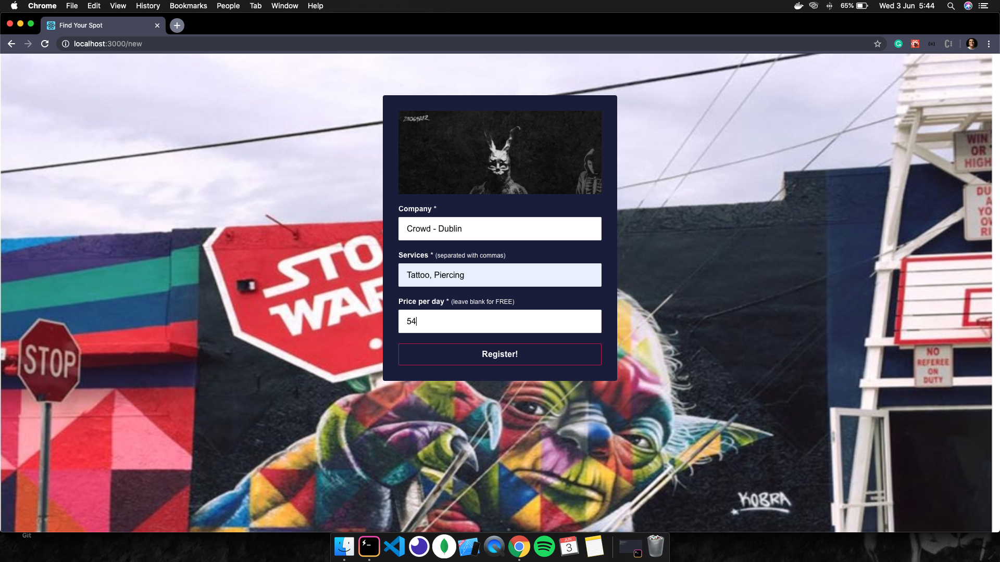

# Find-Your-Spot-Frontend

This is the frontend of the **Find-Your-Spot** project.
This is a project where I could use many professional techniques that is used in "the real world".

## About the project

- The **Find-Your-Spot** is an application where a company can share a spot inside of your building to other developers to use it daily.
- The **_company_** access the website to register a spot saying the company's name, which technology they use and the price.
- The **_user_** access the app to search for a spot. He/She enter with an email and which technologies they work with and then they are send to another page where they can find some spots and request a date.
- The **_company_** receives this request in real-time and can accept or decline it sending the answer also in real-time to the **_user_**.

## The frontend

The frontend was developed with [**_ReactJS_**](https://reactjs.org/) using [**_axios_**](https://www.npmjs.com/package/axios) for the http requests.
[**_react-router-dom_**](https://www.npmjs.com/package/react-router-dom) was used to handle the routes in this application and [**_socket.io_**](https://socket.io/) to connect the requests from the mobile to the web in real-time.

**Login**

**New**

**Register new spot**

**Submit new spot**

**New Dashboard**

## Getting started

1.  Prerequisites

- npm

      npm install npm@latest -g

2. Installation

- Clone the repo

      git clone https://github.com/euguilhermegirardi/Find-Your-Spot-Frontend.git

3. Install NPM packages

       npm install

4. Run the application

       npm run start

## Contributing

1.  Fork the project
2.  Create your feature branch (`git checkout -b feature/AmazingFeature`)
3.  Commit your changes (`git commit -m 'Add some AmazingFeature'`)
4.  Push to the branch (`git push origin feature/AmazingFeature`)
5.  Open a pull request

## License

